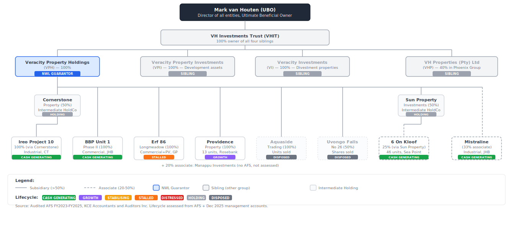
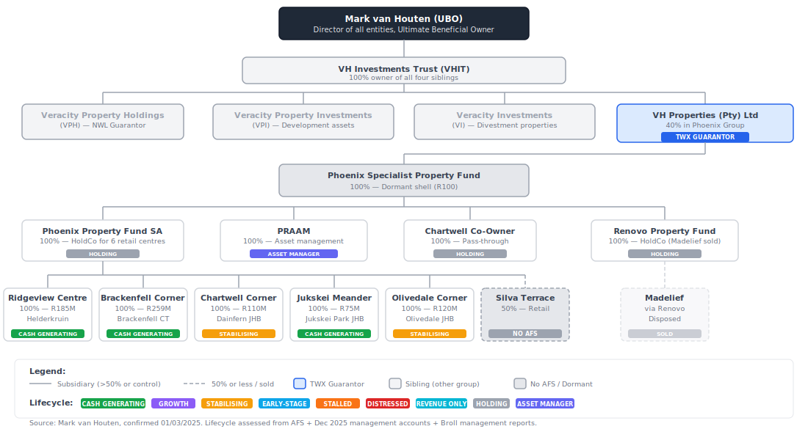

# Guarantor Project Split Report

*Updated: 13 February 2026 — v2 with quantitative credit metrics (Debt/EBITDA, LTV, Altman Z'', Current Ratio, NOI Yield)*

## Veracity

### 1) Diagram

### 2) Asset Companies Overview and Assessment

| Entity | Phase | Conf | Assets (Rm) | Equity (Rm) | E/D | EBITDA (Rm) | Debt/EBITDA | LTV% | Altman Z'' | CR | NOI% |
|---|---|---:|---:|---:|---:|---:|---:|---:|---:|---:|---:|
| Uvongo Falls No 26 [GC] | Growth | 0.43 | 340.2 | 12.4 | 0.04 | 11.3 | n/a | n/a | n/a | n/a | n/a |
| Mistraline | Revenue Only | 0.67 | 161.2 | 31.1 | 0.24 | n/a | n/a | 78% | 0.3 | 0.1x | n/a |
| 6 On Kloof (associate) | Cash Generating | 0.85 | 93.2 | 1.3 | 0.01 | 8.8 | n/a | n/a | n/a | n/a | n/a |
| Providence Property | Growth | 0.67 | 87.6 | 2.9 | 0.03 | 3.7 | 23.2x | 79% | 0.1 | -5.3x | 4.2% |
| Ireo Project 10 / Chepstow | Cash Generating | 0.85 | 76.5 | 6.6 | 0.09 | 16.2 | n/a | n/a | n/a | n/a | n/a |
| Erf 86 Longmeadow | Stabilising | 0.67 | 49.0 | -0.6 | -0.01 | 2.3 | 21.8x | 101% | 0.3 | 1.0x | 4.7% |
| Aquaside Trading | Stabilising | 0.56 | 8.8 | -4.0 | -0.31 | 8.4 | 1.5x | 142% | 4.3 | -0.1x | 95.4% |
| Sun Property [-ve] | Stalled | 0.29 | 7.6 | -8.7 | -0.53 | -2.0 | n/a | n/a | n/a | n/a | n/a |
| BBP Unit 1 Phase II | Cash Generating | 0.85 | 2.9 | 1.3 | 0.80 | 0.2 | n/a | n/a | n/a | n/a | n/a |

**Credit metric thresholds**: Debt/EBITDA < 3.5x = Investment Grade, < 6x = Adequate, < 10x = Stressed, > 10x = Distressed. LTV < 50% = Conservative, < 65% = Adequate, < 80% = Elevated, > 80% = High. Altman Z'' > 2.6 = Safe, 1.1–2.6 = Grey, < 1.1 = Distress. CR > 1.5x = Healthy, > 1.0x = Adequate, < 1.0x = Stressed. NOI benchmark: 8–10% for property.

### 3) Holding Companies

| Entity | Phase | Conf | Assets (Rm) | Equity (Rm) | E/D | EBITDA (Rm) |
|---|---|---:|---:|---:|---:|---:|
| VPH Consolidated (HoldCo) | Holding | 0.14 | 746.5 | 53.4 | 0.08 | n/a |
| Cornerstone Property (HoldCo) | Unknown | 0.14 | 0.0 | 0.0 | 3.00 | n/a |
| Manappu Investments (associate) | Unknown | 0.00 | n/a | n/a | n/a | n/a |
| VHIT (Trust) | Unknown | 0.00 | n/a | n/a | n/a | n/a |
| VI (sibling, divestments) | Unknown | 0.00 | n/a | n/a | n/a | n/a |
| VPI (sibling, dev assets) | Unknown | 0.00 | n/a | n/a | n/a | n/a |

### 4) Status

| Entity | 2025-2024 AFS | 2024-2023 AFS | Management Accounts | Management Report | Valuation | Holding |
|---|:---:|:---:|:---:|:---:|:---:|:---:|
| VPH Consolidated | ✓ | ✓ | ✓ | ✗ | ✗ | ✗ |
| Aquaside Trading | ✓ | ✓ | ✓ | ✗ | ✗ | ✗ |
| BBP Unit 1 Phase II | ✓ | ✓ | ✗ | ✗ | ✗ | ✗ |
| Cornerstone Property (HoldCo) | ✓ | ✓ | ✗ | N/A | N/A | ✓ |
| Ireo Project 10 / Chepstow | ✓ | ✓ | ✗ | ✗ | ✗ | ✗ |
| Mistraline | ✓ | ✓ | ✓ | ✗ | ✗ | ✗ |
| Erf 86 Longmeadow | ✓ | ✓ | ✓ | ✗ | ✗ | ✗ |
| Providence Property | ✓ | ✓ | ✓ | ✗ | ✗ | ✗ |
| Uvongo Falls No 26 [GC] | ✓ | ✓ | ✗ | ✗ | ✗ | ✗ |
| Sun Property [-ve] | ✓ | ✓ | ✗ | ✗ | ✗ | ✗ |
| 6 On Kloof (associate) | ✓ | ✓ | ✗ | ✗ | ✗ | ✗ |
| Manappu Investments (associate) | ✗ | ✗ | ✗ | N/A | N/A | ✓ |
| VPI (sibling, dev assets) | ✗ | ✗ | ✗ | N/A | N/A | ✓ |
| VI (sibling, divestments) | ✗ | ✗ | ✗ | N/A | N/A | ✓ |
| VHIT (Trust) | ✗ | ✗ | ✗ | N/A | N/A | ✓ |
| **TOTAL (15)** | **✓ 11 / ✗ 4 / N/A 0** | **✓ 11 / ✗ 4 / N/A 0** | **✓ 5 / ✗ 10 / N/A 0** | **✓ 0 / ✗ 10 / N/A 5** | **✓ 0 / ✗ 10 / N/A 5** | **5** |

## Phoenix

### 1) Diagram

### 2) Asset Companies Overview and Assessment

| Entity | Phase | Conf | Assets (Rm) | Equity (Rm) | E/D | EBITDA (Rm) | Debt/EBITDA | LTV% | Altman Z'' | CR | NOI% |
|---|---|---:|---:|---:|---:|---:|---:|---:|---:|---:|---:|
| Brackenfell Corner | Cash Generating | 0.67 | 214.0 | 167.1 | 3.56 | n/a | n/a | 23% | -0.4 | n/a | n/a |
| Ridgeview Centre | Revenue Only | 0.67 | 209.2 | 171.5 | 4.55 | n/a | n/a | 19% | 0.8 | n/a | n/a |
| Madelief Shopping Centre | Revenue Only | 0.56 | 171.6 | 131.5 | 3.28 | n/a | n/a | 22% | 1.0 | 3.7x | n/a |
| Olivedale Corner [-ve] | Stabilising | 0.67 | 142.7 | -2.6 | -0.02 | 5.3 | 27.2x | 104% | 0.3 | 1.3x | 3.7% |
| Chartwell Corner [-ve] | Early-stage | 0.67 | 110.0 | -22.8 | -0.17 | 6.9 | 19.2x | 122% | -0.4 | n/a | 6.3% |
| Jukskei Meander | Cash Generating | 0.67 | 99.6 | 90.4 | 9.80 | n/a | n/a | 4% | 7.3 | 1.7x | n/a |
| Chartwell Co-Owner (pass-thru) | Revenue Only | 0.50 | 4.4 | 0.0 | 0.00 | n/a | n/a | 23% | -0.8 | 0.9x | n/a |
| PRAAM (Asset Mgmt) | Stalled | 0.56 | 2.8 | -0.2 | -0.07 | n/a | n/a | 0% | 22.1 | n/a | n/a |

**Credit metric thresholds**: Debt/EBITDA < 3.5x = Investment Grade, < 6x = Adequate, < 10x = Stressed, > 10x = Distressed. LTV < 50% = Conservative, < 65% = Adequate, < 80% = Elevated, > 80% = High. Altman Z'' > 2.6 = Safe, 1.1–2.6 = Grey, < 1.1 = Distress. CR > 1.5x = Healthy, > 1.0x = Adequate, < 1.0x = Stressed. NOI benchmark: 8–10% for property.

### 3) Holding Companies

| Entity | Phase | Conf | Assets (Rm) | Equity (Rm) | E/D | EBITDA (Rm) |
|---|---|---:|---:|---:|---:|---:|
| Phoenix Prop Fund SA (HoldCo) | Holding / Pass-through | 0.14 | 0.0 | -19.6 | -1.00 | n/a |
| Phoenix Specialist (dormant) | Dormant | 0.14 | 0.0 | 0.0 | n/a | n/a |
| Renovo Property Fund (HoldCo) | Holding / Pass-through | 0.14 | 16.4 | 16.4 | n/a | n/a |
| Silva Terrace (50%) | Unknown | 0.00 | n/a | n/a | n/a | n/a |
| Trillium Holdings 1 | Unknown | 0.00 | n/a | n/a | n/a | n/a |
| VH Properties (Pty) Ltd | Unknown | 0.00 | n/a | n/a | n/a | n/a |

### 4) Status

| Entity | 2025-2024 AFS | 2024-2023 AFS | Management Accounts | Management Report | Valuation | Holding |
|---|:---:|:---:|:---:|:---:|:---:|:---:|
| VH Properties (Pty) Ltd | ✗ | ✗ | ✗ | N/A | N/A | ✓ |
| Phoenix Specialist (dormant) | ✓ | ✗ | ✗ | N/A | N/A | ✓ |
| Phoenix Prop Fund SA (HoldCo) | ✓ | ✗ | ✗ | N/A | N/A | ✓ |
| Ridgeview Centre | ✓ | ✗ | ✓ | ✗ | ✗ | ✗ |
| Brackenfell Corner | ✓ | ✗ | ✓ | ✗ | ✗ | ✗ |
| Chartwell Corner [-ve] | ✓ | ✗ | ✓ | ✗ | ✗ | ✗ |
| Jukskei Meander | ✓ | ✗ | ✓ | ✗ | ✗ | ✗ |
| Olivedale Corner [-ve] | ✓ | ✗ | ✓ | ✗ | ✗ | ✗ |
| Madelief Shopping Centre | ✓ | ✗ | ✓ | ✗ | ✗ | ✗ |
| PRAAM (Asset Mgmt) | ✓ | ✗ | ✓ | ✗ | ✗ | ✗ |
| Renovo Property Fund (HoldCo) | ✓ | ✗ | ✗ | N/A | N/A | ✓ |
| Chartwell Co-Owner (pass-thru) | ✓ | ✗ | ✓ | N/A | N/A | ✓ |
| Silva Terrace (50%) | ✗ | ✗ | ✗ | N/A | N/A | ✓ |
| Trillium Holdings 1 | ✗ | ✗ | ✗ | N/A | N/A | ✓ |
| **TOTAL (14)** | **✓ 11 / ✗ 3 / N/A 0** | **✓ 0 / ✗ 14 / N/A 0** | **✓ 8 / ✗ 6 / N/A 0** | **✓ 0 / ✗ 7 / N/A 7** | **✓ 0 / ✗ 7 / N/A 7** | **7** |
