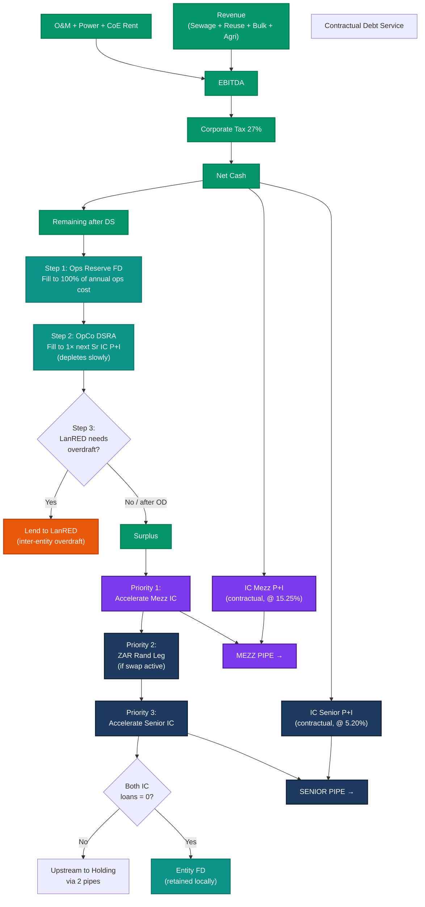
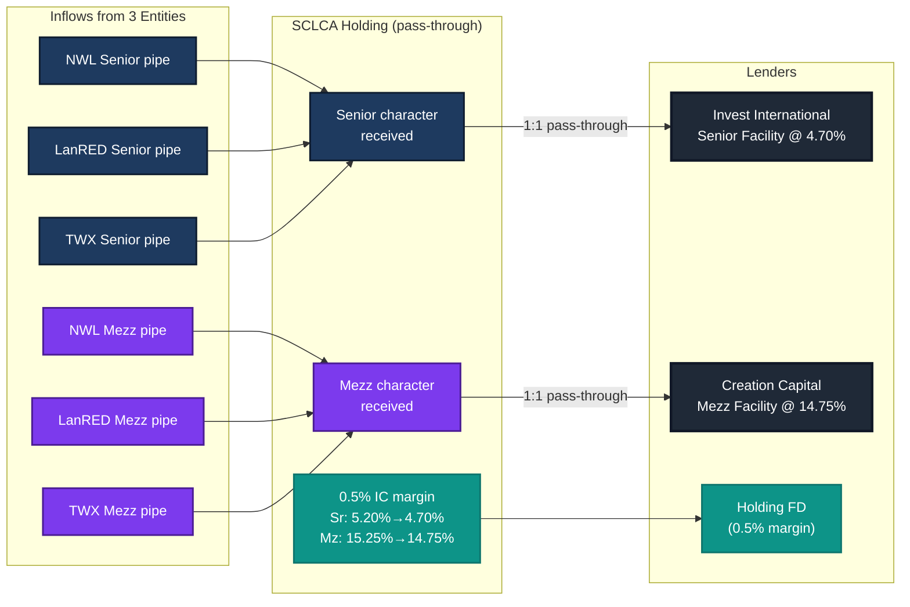
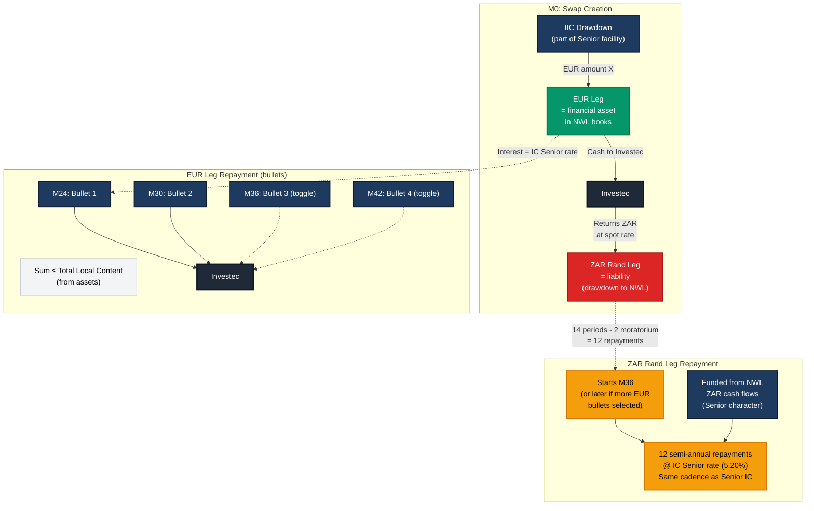
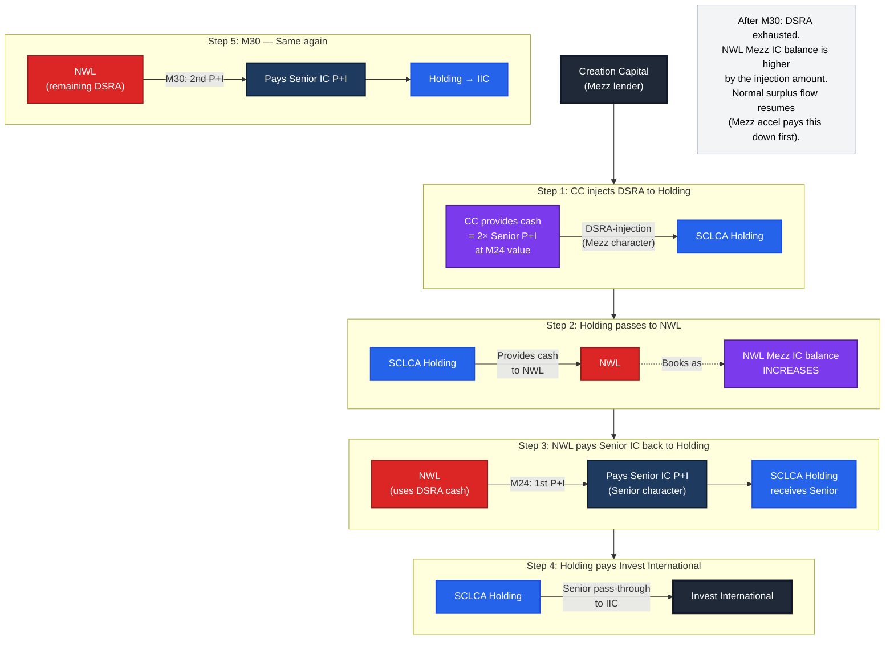
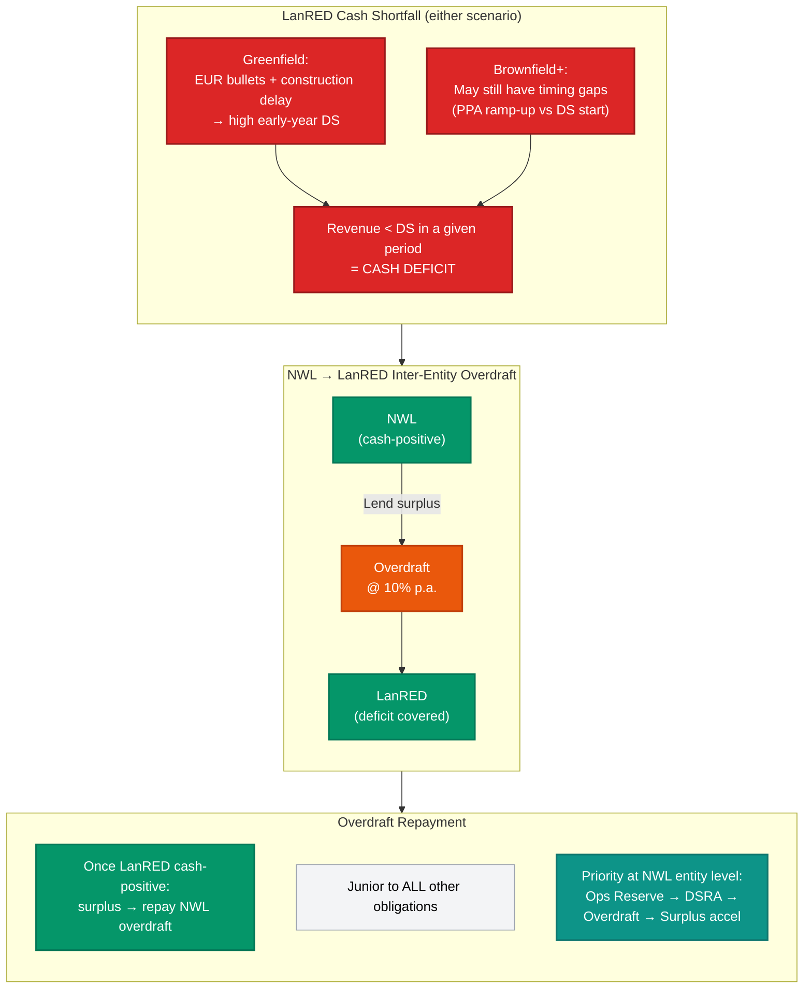

# SCLCA Waterfall v3.1 — Character-Preserving Two-Pipe Architecture

---

## Diagram 1: NWL Entity Level

**Key points:**
- Cash exits NWL through exactly **2 pipes**: Senior IC and Mezz IC
- Surplus is allocated at entity level — holding does NOT decide
- Ops Reserve and DSRA are filled **before** any surplus flows out
- NWL can lend to LanRED (overdraft) before accelerating its own IC loans

---

## Diagram 2: SCLCA Holding Level

**Key points:**
- Holding is a **pure pass-through** — no allocation decisions
- Senior character in → Invest International out (at 4.70%)
- Mezz character in → Creation Capital out (at 14.75%)
- The 0.50% spread on each IC loan accumulates in Holding FD

---

## Diagram 3: EUR/ZAR Cross-Currency Swap (NWL — Bullet Structure)

**Key points:**
- EUR and ZAR legs are **NOT synchronous**
- EUR leg: bullet repayments (toggleable M24/M30/M36/M42), capped at total local content
- ZAR leg: 12 semi-annual level repayments starting M36, at IC Senior rate
- Surplus priority 2 = repay ZAR rand leg (before Senior IC acceleration)
- EUR leg is an **asset**, ZAR leg is a **liability** on NWL's balance sheet

---

## Diagram 4: DSRA-Injection (Cross-Character, M24)

**Key points:**
- This is the **only cross-character flow** in the entire waterfall
- Mezz money (from CC) protects the Senior lender (Invest International)
- The cost to NWL: Mezz IC balance increases → entity surplus will pay this down first (Priority 1: Mezz IC acceleration)
- IIC is never exposed at M24/M30 because DSRA covers both periods
- After M30, normal waterfall resumes with the higher Mezz IC balance

---

## Diagram 5: LanRED Brownfield+ Swap (Repayment Smoothing)

```mermaid
flowchart TB
    classDef sr fill:#1E3A5F,stroke:#0F1D30,stroke-width:2px,color:#fff
    classDef mz fill:#7C3AED,stroke:#4C1D95,stroke-width:2px,color:#fff
    classDef zar fill:#F59E0B,stroke:#D97706,stroke-width:2px,color:#000
    classDef bank fill:#1F2937,stroke:#111827,stroke-width:3px,color:#fff
    classDef lender fill:#1F2937,stroke:#111827,stroke-width:3px,color:#fff
    classDef asset fill:#059669,stroke:#047857,stroke-width:2px,color:#fff
    classDef liab fill:#DC2626,stroke:#991B1B,stroke-width:2px,color:#fff
    classDef note fill:#F3F4F6,stroke:#9CA3AF,stroke-width:1px,color:#000
    classDef gn fill:#059669,stroke:#047857,stroke-width:2px,color:#fff

    subgraph SETUP["M0: Swap Setup (Brownfield+)"]
        direction LR
        IIC_DRAW["IIC Drawdown<br/>(LanRED Senior IC amount)"]:::sr
        EUR_LEG["EUR Leg<br/>= financial asset<br/>Notional = Senior IC value"]:::asset
        INVESTEC["Investec"]:::bank
        ZAR_LEG["ZAR Rand Leg<br/>= liability<br/>(drawdown to LanRED)"]:::liab

        IIC_DRAW -->|"Full Senior IC value"| EUR_LEG
        EUR_LEG -->|"EUR to Investec"| INVESTEC
        INVESTEC -->|"Returns ZAR<br/>at spot rate"| ZAR_LEG
    end

    subgraph EUR_SIDE["EUR Leg: 7 Years (1:1 = IIC schedule)"]
        direction TB
        E_NOTE["Same schedule as IIC facility<br/>Same cadence, same amounts<br/>14 semi-annual periods<br/>(M24 → M90)"]:::sr
        E_FLOW["LanRED EUR revenue<br/>→ EUR leg P+I<br/>→ Investec"]:::sr
    end

    subgraph ZAR_SIDE["ZAR Rand Leg: 14 Years (smoothed)"]
        direction TB
        Z_START["Starts M24<br/>(same 24-month moratorium)"]:::zar
        Z_SCHED["28 semi-annual repayments<br/>@ IC Senior rate (5.20%)<br/>M24 → M192"]:::zar
        Z_EFFECT["Lower per-period payment<br/>→ more surplus cash<br/>→ rapid Mezz IC repayment"]:::gn
        Z_START --> Z_SCHED --> Z_EFFECT
    end

    subgraph COMPARE["Effect: Repayment Curve Smoothing"]
        direction TB
        C7["Without swap (7yr):<br/>High DS → Low surplus<br/>→ Slow Mezz paydown"]:::note
        C14["With swap (14yr ZAR):<br/>Low DS → High surplus<br/>→ Fast Mezz paydown"]:::gn
    end
```

**Key points:**
- Swap notional = **full LanRED Senior IC value** (not partial like NWL bullets)
- EUR leg is **1:1 identical** to the IIC facility schedule (7 years, same cadence, same amounts)
- ZAR rand leg is **extended to 14 years** (28 semi-annual repayments) with same 24-month moratorium
- Effect: halves the per-period debt service → frees surplus cash → **accelerates Mezz IC repayment**
- Brownfield+ has Day 1 PPA revenue → less likely to need overdraft (but not excluded)

---

## Diagram 6: LanRED Overdraft (Both Scenarios)

**Key points:**
- Available for **both** Greenfield and Brownfield+ — model computes if/when LanRED has a deficit
- NWL lends to LanRED via **inter-entity overdraft** at 10% p.a.
- Overdraft priority: junior to all IC loans — repaid from LanRED surplus once cash-positive
- Greenfield more likely to need it (EUR bullets + construction delay); Brownfield+ less likely but not excluded

---

## Summary Tables

### Entity-Level Cash Priority

| Step | Action | Notes |
|------|--------|-------|
| 0 | Pay contractual IC Sr P+I + IC Mz P+I | Mandatory, M24+ |
| 1 | Fill Ops Reserve FD (100% of annual ops cost) | Operational buffer |
| 2 | Fill OpCo DSRA (1× next Senior IC P+I) | Depletes slowly over time |
| 3 | LanRED overdraft (NWL → LanRED if needed) | Inter-entity lending |
| 4 | **Surplus** → Mezz IC acceleration | Mezz character → Mezz pipe |
| 5 | **Surplus** → ZAR rand leg (if swap active) | Senior character → Senior pipe |
| 6 | **Surplus** → Senior IC acceleration | Senior character → Senior pipe |
| 7 | After both IC = 0 → Entity FD | Retained at entity |

### Holding Level (pass-through only)

| In | Out | Notes |
|----|-----|-------|
| Senior character | → Invest International (IIC) | 1:1 pass-through |
| Mezz character | → Creation Capital (CC) | 1:1 pass-through |
| 0.5% IC margin | → Holding FD | Sr: 5.20% - 4.70%, Mz: 15.25% - 14.75% |

### Special Events Timeline

| When | What | Character | Details |
|------|------|-----------|---------|
| M0 | EUR swap leg created from IIC drawdown | Senior | Cash to Investec = **financial asset**. Investec returns rand leg = **liability** |
| M0 | LanRED Brownfield+ swap (if selected) | Senior | Notional = full LanRED Senior IC. EUR leg 1:1 = IIC schedule. ZAR leg 14yr extended |
| M12 (Y2) | DTIC + GEPF grants | Senior | Prepay NWL Senior IC |
| M24 (FEC) | CC DSRA-injection (2×P+I) | **Cross** | CC → holding → NWL. NWL pays Sr IC → holding → IIC. Mezz IC increases at NWL |
| M24 (NWL SWAP) | EUR leg bullet repayments | Senior | Toggleable at top (swap vs FEC). Sum ≤ total local content |
| M24 (LR BF+) | LanRED ZAR rand leg starts | Senior | 28 semi-annual repayments over 14yr (smoothed), @ IC Senior rate |
| M24+ (LR) | LanRED overdraft (if deficit) | Senior | Auto-triggered when LanRED DS > revenue in any period |
| M36+ | NWL rand leg starts | Senior | 12 semi-annual repayments, @ IC Senior rate, same cadence as Senior IC |
| M36+ | Normal surplus flow | — | Contractual + surplus cascade |

### One-Time Dividend

- Calculated at IC Mezz level as a **cost**
- Accrues at 5.25% p.a. on CC opening balance
- Paid as one shot once Mezz IC = 0, through normal Mezz pipe

### LanRED Overdraft (both scenarios)

- NWL lends to LanRED when LanRED has cash shortfall in any period
- Overdraft @ 10% p.a., junior to all IC obligations
- Priority at NWL entity level: Ops Reserve → OpCo DSRA → LanRED overdraft → Surplus acceleration
- Model computes if/when deficit occurs — more likely for Greenfield, but not excluded for Brownfield+

### LanRED Brownfield+ Swap

- Swap notional = full LanRED Senior IC value
- **EUR leg**: 1:1 identical to IIC facility schedule (7yr, 14 semi-annual, same cadence & amounts)
- **ZAR rand leg**: Extended to 14 years (28 semi-annual repayments), starts M24 (same 24-month moratorium)
- Per-period ZAR DS roughly halved → surplus frees up → **accelerates Mezz IC repayment**
- `lanred_swap` config: `extended_repayments_sr: 28`, `extended_repayments_mz: 20`

### Greenfield vs Brownfield+ Comparison

| Parameter | Greenfield | Brownfield+ |
|-----------|-----------|-------------|
| Revenue start | M18 (post-construction) | Day 1 (PPA revenue) |
| EUR leg | Bullet payments (M24, M30) | 1:1 = IIC schedule (7yr level) |
| ZAR rand leg | N/A (no swap) | 14yr, 28 semi-annual, starts M24 |
| Overdraft needed | Likely (EUR bullets + construction delay) | Less likely (Day 1 revenue + smoothed DS) |
| Mezz IC paydown | Slower (high DS) | Faster (smoothed DS → more surplus) |
| Breakeven | ~Y3 | ~Y2 |
